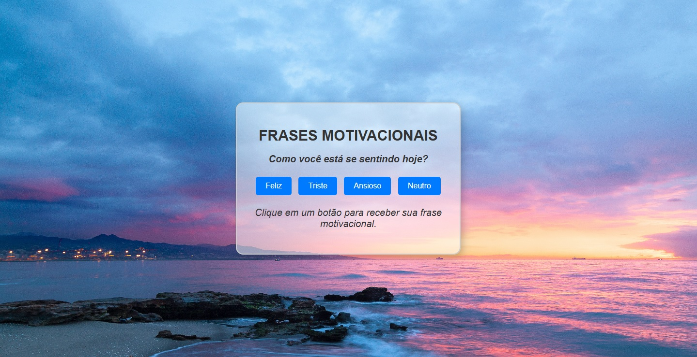

# Projeto Motivacional

Este é um projeto simples que gera frases motivacionais com base no estado emocional do usuário. O front-end foi desenvolvido em JavaScript e o back-end em Python (Flask).

## Funcionalidades
- O usuário seleciona seu estado emocional clicando em um botão.
- O sistema retorna uma frase motivacional correspondente à emoção escolhida.
- Interface simples e responsiva com uma imagem de fundo personalizada.

## Tecnologias Utilizadas
- **Front-End**: HTML, CSS, JavaScript
- **Back-End**: Python (Flask)
- **Ferramentas**: Visual Studio Code, GitHub

